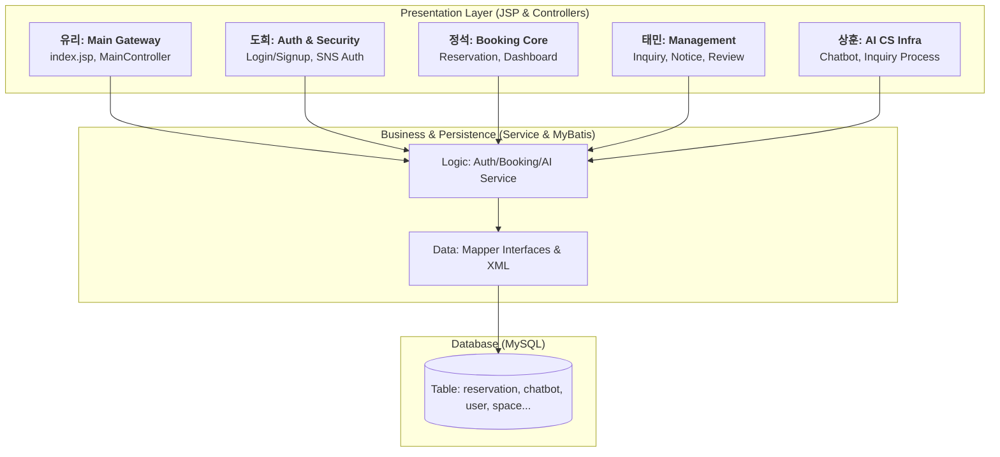
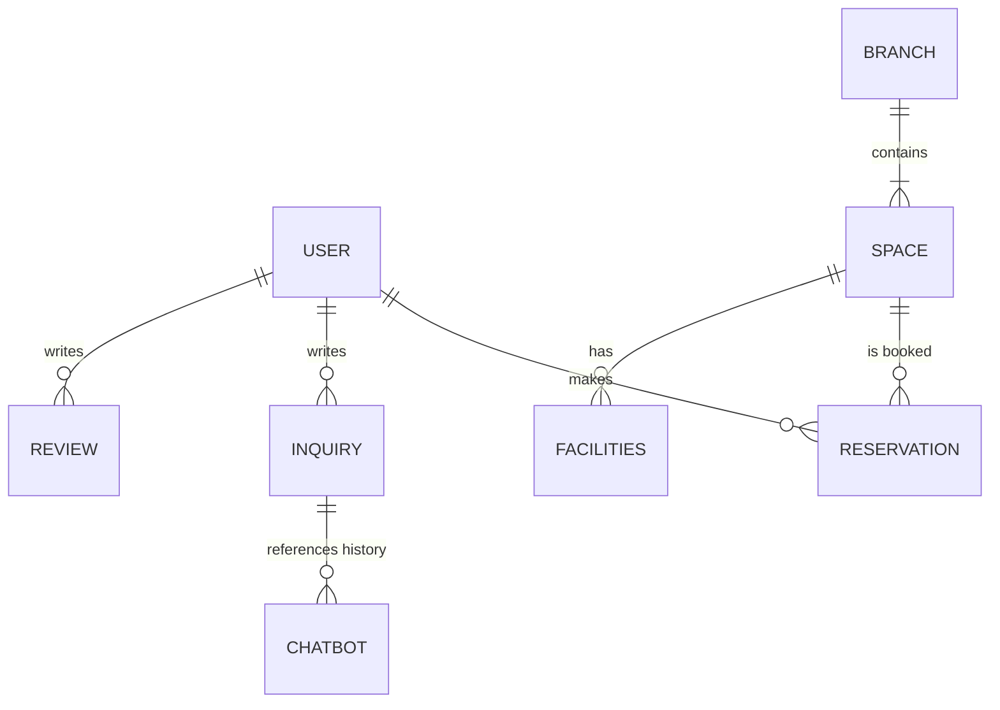

# 🏛️ 프로젝트 통합 구조 정의서 (최종 완성본)

본 보고서는 **상훈(Lead Architect)**님의 설계 가이드라인을 바탕으로 **정석, 도희, 태민, 유리** 팀원의 모든 작업물을 파일 단위로 완벽하게 통합한 최종 시스템 아키텍처 정의서입니다.

---

## 1. 🏗️ 기술적 레이어드 아키텍처 (Technical Layers)

시스템은 관심사 분리를 통해 유지보수성과 확장성을 극대화한 **4계층 구조**를 채택했습니다.



---

## 2. 🧩 팀별 역할 및 도메인 책임 (Domain Roles)

팀원별 전문 분야와 소유하고 있는 핵심 데이터베이스 테이블을 명확히 정의합니다.

| 담당자 | 핵심 도메인 | 주요 구현 기술 및 연동 DB |
| :--- | :--- | :--- |
| **상훈** | **AI & CS Architecture** | AI 챗봇 인프라(`chatbot`), 전사적 문의 시스템(`inquiries`) 표준 모델 설계 |
| **정석** | **Resource & Transaction** | 예약 시스템(`reservation`), 지점/공간/시설(`branch, space, facilities`) 관리 |
| **태민** | **Management & CS** | 고객 관리(`user`), 공지사항(`notice`), 리뷰 및 신고(`review, review_report`), 설정 로그 |
| **도희** | **Auth & Identity** | 스프링 시큐리티, 소셜 로그인(Kakao/Naver) 연동, 회원 인증 데이터 관리 |
| **유리** | **Visual Interface** | 메인 랜딩 페이지 아키텍처 및 전반적인 UI 통합 엔트리 포인트 |

---

## 3. 🗄️ 데이터베이스 연동 구조 (DB Mapping)

기능 도메인과 데이터베이스 간의 유기적 관계를 통해 시스템의 데이터 흐름을 정의합니다.



### 📋 주요 테이블별 연동 상세 설명

| 테이블명 | 담당 도메인 | 기능 용도 |
| :--- | :--- | :--- |
| **`user`** | 인증/고객관리 | 회원 기본 데이터, 로그인 인증 정보, 권한/등급 관리 |
| **`reservation`**| 예약 시스템 | 상훈(Lead)의 표준에 따른 공간 예약 이력 및 상태 값 저장 |
| **`space` / `branch`** | 공간 관리 | 오피스 지점 정보 및 지점별 상세 공간/사무실 데이터 |
| **`inquiries`** | 고객 지원 | 1:1 고객 문의 내역과 답변 상태 (상훈 아키텍처 준수) |
| **`chatbot`** | AI 서비스 | ChatGPT 연동 대화 맥락(Context) 및 세션별 히스토리 기록 |
| **`notice` / `review`** | 게시판/커뮤니티 | 서비스 공지사항 및 사용자 리얼 이용 후기 데이터 관리 |

---

## 🌲 4. 통합 프로젝트 디렉토리 트리 (Optimized Folder Tree)

제공된 이미지 형식을 바탕으로, 모든 팀원의 모듈이 가장 깔끔하게 배치된 **최적화된 폴더 트리 모델**입니다.

```text
project05
├── src/main
│   ├── java/org/study/project05
│   │   ├── admin/ (관리자 대시보드 및 설정 전용 패키지)
│   │   ├── auth/ (도희: 인증 및 SNS 로그인 인프라)
│   │   ├── chat/ (상훈: AI 챗봇 서비스 모듈)
│   │   ├── common/ (공통 유틸리티, 암호화, 페이징 로직)
│   │   ├── customer/ (태민: 고객 데이터 전문 관리)
│   │   ├── index/ (유리: 메인 컨트롤러 및 입구 디자인)
│   │   ├── inquiry/ (상훈: 표준화된 고객 문의 프로세스)
│   │   ├── notice/ (태민: 서비스 공지사항 도메인)
│   │   ├── reservation/ (정석: 예약 시스템 핵심 트랜잭션)
│   │   ├── review/ (태민, 정석: 이용 후기 및 별점 시스템)
│   │   ├── space/ (정석: 오피스 자원 및 시설 데이터 관리)
│   │   └── project05Application.java (시스템 실행 엔트리)
│   ├── resources
│   │   ├── mapper/ (MyBatis SQL XML 매퍼 통합 관리 구역 - 핵심)
│   │   └── application.properties, application-secret.properties
│   └── webapp
│       ├── static/ (CSS, JavaScript, Image 자산 모듈화)
│       └── WEB-INF/views
│           ├── common/ (chatbot.jsp 등 공통 UI 컴포넌트)
│           ├── inquiry/, auth/, reservation/ (기능 도메인별 JSP 폴더)
│           └── index.jsp (메인 관문 페이지)
└── pom.xml
```

---

## 🌳 5. 상세 파일 단위 통합 구조 (File-Level Detailed Architecture)

**DB 연동 파일(Mapper, XML, VO)**과 핵심 로직 파일을 입체적으로 배치한 최종 상세 도면입니다.

```text
src/main/java/org/study/project05
├── auth/ (인증 인프라)
│   ├── controller/NaverAuthController.java, KakaoAuthController.java
│   └── config/SecurityConfig.java
├── reservation/ (정석: 예약 핵심)
│   ├── controller/ReservationController.java
│   ├── service/ReservationService.java, ReservationServiceImpl.java
│   ├── mapper/ReservationMapper.java ([Table: reservation])
│   └── vo/ReservationVO.java (DB Model)
├── inquiry/ (상훈: 문의 표준)
│   ├── controller/InquiryController.java
│   ├── service/InquiryService.java, InquiryServiceImpl.java
│   ├── mapper/InquiryMapper.java ([Table: inquiries])
│   └── vo/InquiryVO.java (DB Model)
├── chat/ (상훈: AI 챗봇)
│   ├── controller/ChatController.java
│   ├── service/ChatGPTService.java
│   └── vo/ChatVO.java ([Table: chatbot])
├── customer/ (태민: 고객 관리)
│   ├── mapper/CustomerMapper.java ([Table: user])
│   └── vo/CustomerVO.java
├── space/ (정석: 공간/시설)
│   ├── mapper/SpaceMapper.java, BranchMapper.java, FacilityMapper.xml
│   └── vo/SpaceVO.java, BranchVO.java, FacilityVO.java
├── resources/mapper/ (통합 XML 매퍼 저장소 - 가장 중요)
│   ├── ChatMapper.xml (상훈), InquiryMapper.xml (상훈)
│   ├── ReservationMapper.xml (정석), SpaceMapper.xml (정석)
│   ├── NoticeMapper.xml (태민), ReviewMapper.xml (태민)
│   └── CustomerMapper.xml (태민)
```

---

### 🎯 아키텍처의 핵심 가치 (Lead Recommendations)

- **상훈(Lead)의 표준화 원칙**: 모든 도메인에서 Camel Case 필드명 명명 규칙을 엄격히 준수하여 데이터 바인딩 오류를 원천 차단합니다.
- **기능 중심의 패키징 전략**: 각 담당자가 자신의 패키지 내에서만 작업함으로써 협업 시 발생하는 코드 충돌(Conflict)을 회기적으로 줄입니다.
- **MyBatis 중앙 관리**: 모든 SQL 쿼리(XML)를 한곳에 모아 관리함으로써 중복 쿼리를 방지하고 DB 접근 로직을 투명하게 유지합니다.

---

> 본 보고서는 상훈님의 설계 하에 **정석, 도희, 태민, 유리** 팀원의 역량이 가장 빛을 발할 수 있는 **완성형 아키텍처**를 공식 정의합니다.
