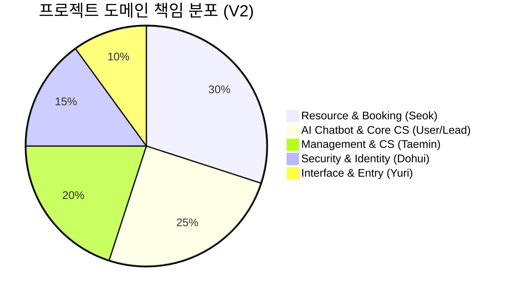
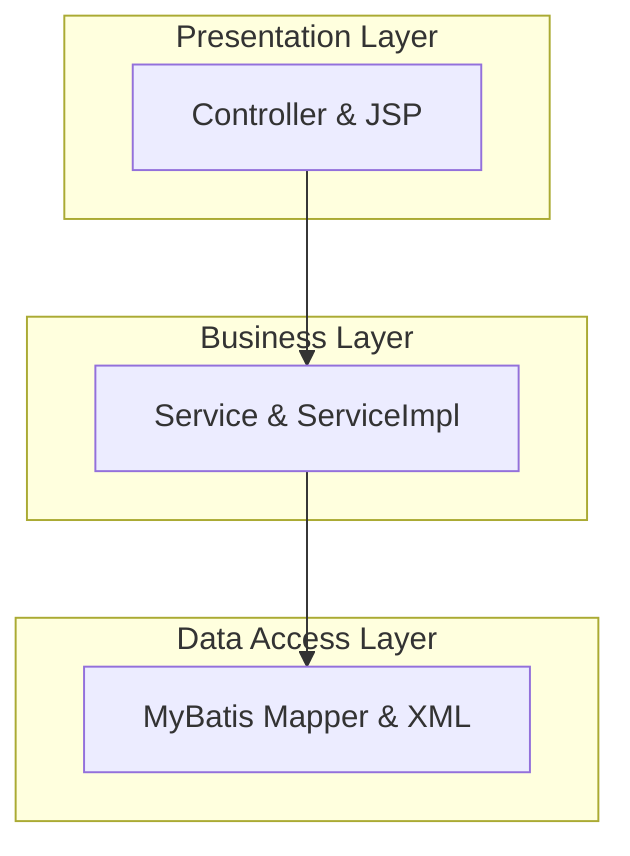

# 🏛️ 프로젝트 아키텍처 및 통합 구조 보고서 (Ver 2.0)

사용자(Lead)의 AI 챗봇 및 아키텍처 가이드 역할을 포함하여, 팀원 5인의 기여도를 시각화한 초기 통합 보고서입니다.

---

## 1. 👥 팀별 도메인 역할 및 지분 (5인 통합)



| 담당자 | 핵심 역할 | 주요 구현 범위 |
| :--- | :--- | :--- |
| **사용자 (Lead)** | **AI & Infrastructure** | ChatGPT 챗봇 연동, 문의하기(Inquiry) 프로세스 표준화, 공통 기반 설계 |
| **석 (Seok)** | **Resource Core** | 공간/지점 관리, 예약 시스템 로직, 관리자 대시보드 |
| **태민 (Taemin)** | **CS & Board** | 고객 관리, 공지사항/리뷰, 시스템 로그 및 관리자 설정 |
| **도희 (Dohui)** | **Auth & Identity** | 스프링 시큐리티, 소셜 로그인(Kakao/Naver), 회원 프로필 |
| **유리 (Yuri)** | **Visual Gateway** | 메인 랜딩 페이지 UI/UX, 플랫폼 엔트리 디자인 통합 |

---

## 2. 🌲 통합 프로젝트 디렉토리 트리 (Optimized Folder Tree)

```text
project05
├── src/main
│   ├── java/org/study/project05
│   │   ├── admin/
│   │   ├── auth/
│   │   ├── chat/ (사용자)
│   │   ├── common/
│   │   ├── customer/
│   │   ├── index/
│   │   ├── inquiry/ (사용자)
│   │   ├── notice/
│   │   ├── reservation/ (석/정석)
│   │   ├── review/
│   │   ├── space/
│   │   └── vo/
│   ├── resources
│   │   ├── mapper/
│   │   └── application.properties
│   └── webapp
│       ├── static/
│       └── WEB-INF/views
│           ├── common/
│           ├── inquiry/
│           ├── reservation/
│           └── index.jsp
└── pom.xml
```

---

## 3. 🏗️ 기술적 레이어드 아키텍처


