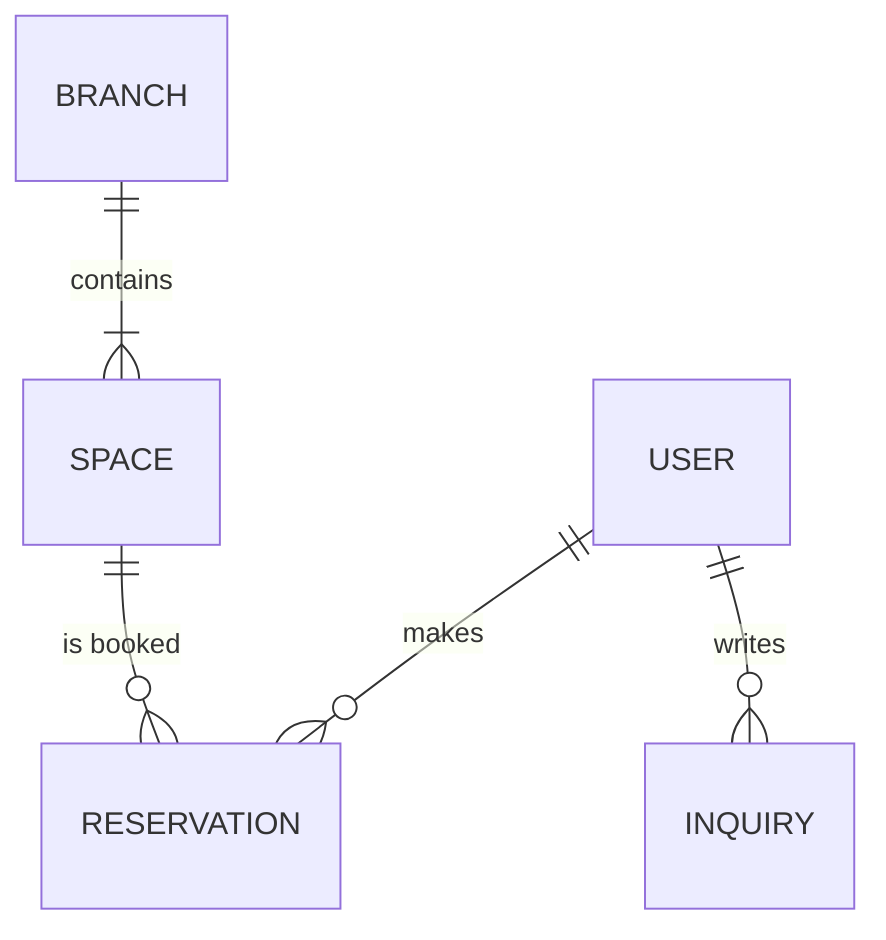

# 🏛️ 프로젝트 아키텍처 및 통합 가이드라인 (Ver 3.0)

상훈(Lead)과 정석(Jeongseok)을 포함한 5인 체제의 DB 연동 및 파일 단위 상세 가이드라인입니다.

---

## 1. 🗄️ DB 테이블 및 도메인 연동 구조



### 📋 주요 테이블별 연동 상세

| 테이블명 | 담당 도메인 | 기능 및 활용 설명 |
| :--- | :--- | :--- |
| **`user`** | 인증/고객관리 | 회원 기본 정보 및 로그인 인증 |
| **`reservation`**| 예약 시스템 | 상훈(Lead)의 거래 표준을 따른 공간 예약 데이터 |
| **`space` / `branch`** | 공간 관리 | 지점 및 개별 오피스 자원 데이터 |
| **`inquiries`** | 고객 지원 | 1:1 문의 및 답변 데이터 (상훈 가이드 준수) |
| **`chatbot`** | AI 서비스 | ChatGPT 기반 대화 맥락 및 히스토리 관리 |

---

## 🌳 2. 상세 파일 단위 아키텍처 (File-Level Detailed Tree)

```text
src/main/java/org/study/project05
├── auth/NaverAuthController.java, NaverUserVO.java
├── reservation/ (정석)
│   ├── controller/ReservationController.java
│   ├── mapper/ReservationMapper.java
│   └── vo/ReservationVO.java
├── inquiry/ (상훈)
│   ├── controller/InquiryController.java
│   ├── mapper/InquiryMapper.java
│   └── vo/InquiryVO.java
├── resources/mapper/ (XML 매퍼 전체)
│   ├── ChatMapper.xml, InquiryMapper.xml (상훈)
│   ├── ReservationMapper.xml, SpaceMapper.xml (정석)
│   └── NoticeMapper.xml, ReviewMapper.xml (태민)
```

### 🎯 V3의 특징
- 모든 MyBatis XML 파일을 도메인별로 그룹화하여 데이터 흐름을 명문화했습니다.
- 상훈(Lead)님의 파일 명명 규칙(Camel Case)을 적용한 상세 가이드입니다.
